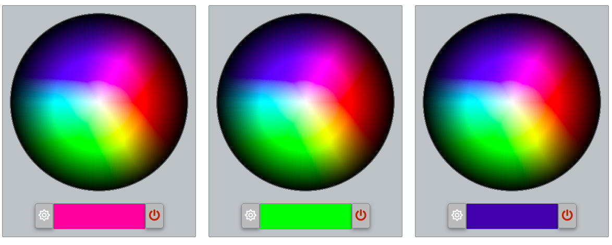

# ColorPicker

Colorpicker is a simple jQuery plugin for color picking, it's built for my SmartHome software (controlling RGB LedStrip)
# New Features:
  - Can choose a color
  - When picked it, a CallBack run with the color value. 
  - Black and White buttons


### How to use?

It's simple, just see the following html: 

```
<!doctype html>
<html lang="en">
<head>
    <meta charset="utf-8">
    <title>The HTML5 colorpicker</title>
    <meta name="description" content="The HTML5 colorpicker">
    <meta name="author" content="maros">
    <meta name="viewport" content="width=device-width, initial-scale=1.0">
    <link rel="stylesheet" href="colorpicker.css">
</head>
<body>
    <br/>
    <div class="pickerarea" style="display: inline-block">
    </div>
    <div class="pickerarea2" style="display: inline-block">
    </div>
    <div class="pickerarea3" style="display: inline-block">
    </div>
    <script src="https://code.jquery.com/jquery-3.4.1.min.js" integrity="sha256-CSXorXvZcTkaix6Yvo6HppcZGetbYMGWSFlBw8HfCJo=" crossorigin="anonymous"></script>
    <script src="https://kit.fontawesome.com/02bc8a7f79.js" crossorigin="anonymous"></script>
    <script src="colorpicker.js"></script>
    <script>
        $(document).ready(function () {
            $(".pickerarea").ColorPicker(
                {
                    callback: function(color){
                        console.log("Color is: "+color);
                    }
                }
            );
            $(".pickerarea2").ColorPicker(
                {
                    callback: function(color){
                        console.log("Color is: "+color);
                    }
                }
            );
            $(".pickerarea3").ColorPicker(
                {
                    callback: function(color){
                        console.log("Color is: "+color);
                    }
                }
            );
        });
    </script>
</body>
</html>
```

Enjoy! 

License
----

MIT


**Free Software, Hell Yeah!**

